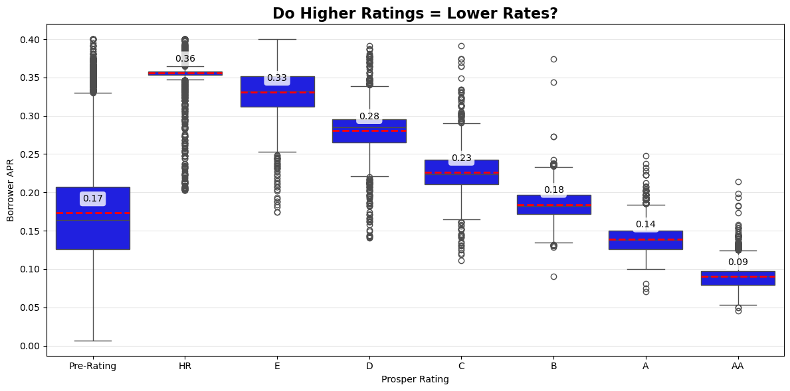
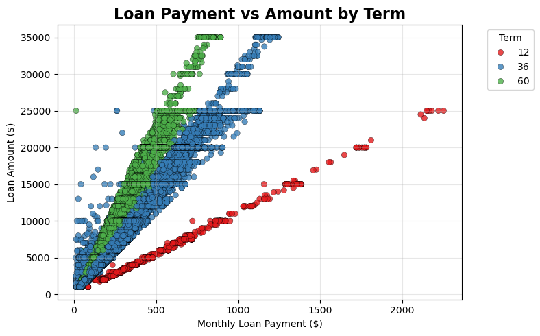
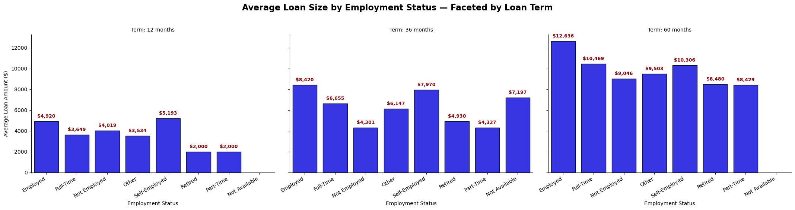

# Prosper Loan Risk & Access  
## **How Credit, Income, and Employment Shape Borrowing — A Data Story**  
**By Mustafa Taha** | *Udacity Data Analyst Nanodegree*  

[](https://python.org)  
[](https://pandas.pydata.org)  
[](https://seaborn.pydata.org)  
[](LICENSE)  
[](https://udacity.com)

---

## Project Overview

This project analyzes **106,409 Prosper peer-to-peer loans (2005–2014)** to answer:

> **How do credit rating, employment stability, income, and loan term determine borrowing cost, loan size, and default risk?**

Using **exploratory** and **explanatory** data analysis, I uncovered **Prosper’s dual risk gate** — where **credit opens the door**, but **employment and income decide how far you go**.

---

## Key Insights

| Insight | Finding |
|--------|--------|
| **Rating Drives Cost & Access** | **AA-rated**: ~**9% APR**, **$12K+ loans**<br>**HR-rated**: ~**36% APR**, **$3.5K loans** → **4× cost, 3.5× less access** |
| **Employment + Term = Dual Risk Gate** | **Full-time (60-month)**: **$12,636**<br>**Unstable jobs**: **$4K–$5K**, **no 60-month access** |
| **Payment Is Formula-Driven** | **3 perfect bands** by term — **36-month = default product** |
| **Income Neutralizes Risk** | **$100K+ HR borrowers**: **~4% default** (vs **24%** low-income HR) |

> **Takeaway**:  
> **Credit score starts the loan. Employment and income finish it.**

---

## Visualizations (Click to Expand)

| Visualization | Insight |
|--------------|--------|
| <details><summary>Rating vs APR</summary></details> | **Risk-based pricing works** — 4× APR gap from AA to HR |
| <details><summary>Payment vs Amount by Term</summary></details> | **3 formulaic bands** — 36-month is the standard |
| <details><summary>Employment × Term Facet</summary></details> | **Only stable jobs get big, long loans** |

---
## Repository Structure

```plaintext
prosper-loan-risk-analysis/
│
├── data.zip                                    Raw dataset (unzip to run)
├── prosper_loan_data_clean.csv                 Cleaned data → move to root
│
├── Part_I_exploration_template_loan.ipynb      Full EDA (univariate → multivariate)
├── Part_II_explanatory_template_work_loan.ipynb Executive summary & storytelling
│
├── reports/                                    HTML/PDF reports
│   ├── Part_I_exploration_report.html
│   └── Part_II_explanatory_report.html
│
├── visuals/                                    Key visuals
│   ├── rating_vs_apr.png
│   ├── loan_payment_vs_amount_by_term.png
│   └── employment_term_facet.png
│
├── .gitignore                                  Keeps repo clean
├── README.md                                   This file
└── LICENSE                                     MIT License

## Technologies Used

- **Python** (Pandas, NumPy,MatplotLib,Seaborn)  
- **Matplotlib & Seaborn** (publication-quality plots)  
- **Jupyter Notebook** (interactive analysis)  
- **Q-V-O Framework** (Question → Visualization → Observation)

---

## Business Impact

| Recommendation | Benefit |
|----------------|--------|
| **Incorporate employment type into Prosper Rating** | Better long-term default prediction |
| **Offer income-verified premium pricing** | Reduce HR defaults from 24% → ~4% |
| **Limit 60-month loans to stable jobs** | Control risk exposure |

---

## Result

**Project Status**: **PASSED — OUTSTANDING**  
**Reviewer Quote**:  
> _“Easy to navigate, well-explained, and professional. Great Q-V-O flow!”_

---

## Let's Connect

[](https://linkedin.com/in/yourprofile)  
[](https://yourportfolio.com)  
[](mailto:your.email@example.com)

---

## License

This project is licensed under the **MIT License** — see [`LICENSE`](LICENSE) for details.

---

**Built with curiosity. Validated with data. Delivered with clarity.**